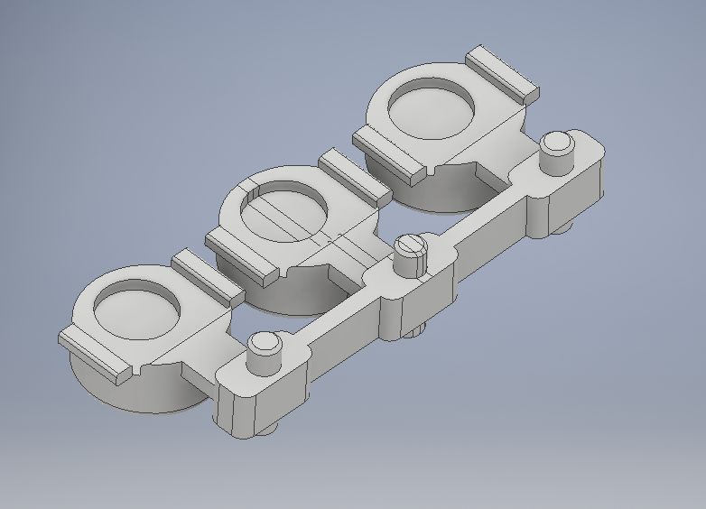

## 3D printing

Print with SLA or SLS, tolerance 0.15mm.
Inspect the printed parts and remove any imporfections with a knife.

Check fit and button functionality after installation. Adjust if needed.

