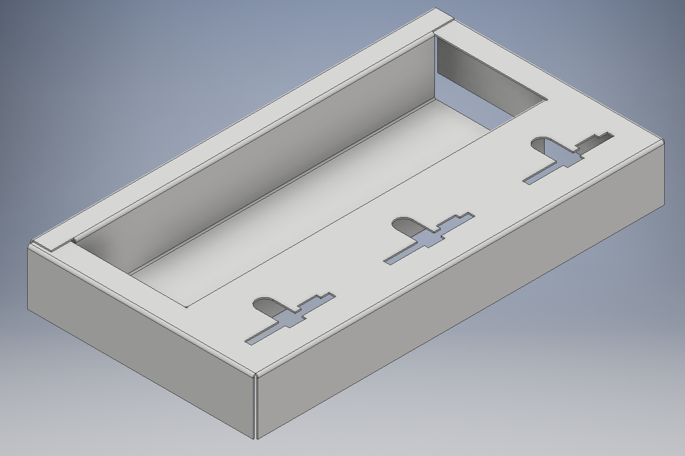

## The box

Get box number 4:
https://detail.tmall.com/item.htm?id=538864080722

## Laser cutting the insert.

I used 400g black cardboard, and the color and texture were identical with the rest of the box:
https://item.taobao.com/item.htm?id=528586333770

Use Insert.dxf to cut the outlines. Note that the file also contains the fold lines. Either remove
them before cutting, or cut them with minimial power to only mark the lines.

Use a ruler and a flat screwdriver to indent the fold lines, then fold the insert in accordance with the
drawing. Practive makes perfect.

